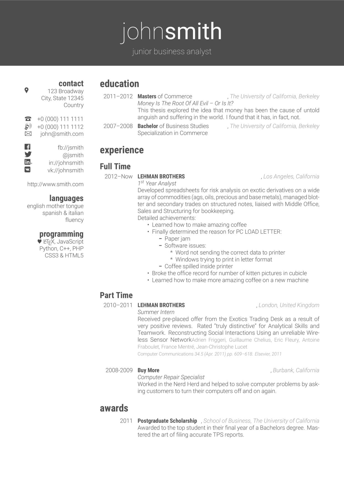

# The perfect German CV in LaTeX

This is what the perfect CV to apply in Germany should look like. It's currently written in English making it easier for expats and other foreigners to fill it out.

This is a work in progress, so not everything is adapted to German rules and norms for CVs. If you're unsure, check out blog posts on the topic:
* [What a good German CV looks like](http://www.germanitjobs.com/blog/what-a-good-german-cv-looks-like/)
* [DOs and DON'Ts for a German CV](http://www.germanitjobs.com/blog/a-german-cv-some-dos-and-no-we-always-keep-things-positive/)



## Usage
Install the fonts and biber if you haven't already and just execute

```
make
```

or if you prefer to compile it manually

```
xelatex -interaction=nonstopmode cv.tex
biber cv.bcf
xelatex -interaction=nonstopmode cv.tex
xelatex -interaction=nonstopmode cv.tex
```

## Requirements
* [Roboto fonts](https://material.google.com/resources/roboto-noto-fonts.html)
* [Biber instead of biblatex](http://biblatex-biber.sourceforge.net/)

## Acknowledgements
* [@afriggeri](https://github.com/afriggeri): Author of the original template
* [@Nadorrano](https://github.com/Nadorrano/cv-friggeri-x): Author of the A4 layout and B/W version

## License
[MIT](LICENSE)
